## 🧭 5-Second Summary (Minimap)

* **Symptom:** Drag-and-drop moves tasks between columns, but the **column header task count does not update**.
* **Reality:** Board state **inside `BoardProvider` updates correctly**, and the tasks list renders correctly.
* **Root Cause:** The header uses **stale props** (`column.taskIds.length` from the initial server data) instead of the **live state from React context**.
* **Fix:** Derive the count from **context-driven tasks** (`useTasksInColumn`) or from the column in context, not from the original prop.
* **Lesson:** Never mix **two sources of truth** (initial props + internal context state) for the same piece of data.

---

# Root Cause Analysis: Column Task Count Not Updating After Drag & Drop

> Keywords: React context state not updating, Next.js App Router, dnd-kit drag and drop bug, stale props vs context, Kanban board column count mismatch.

---

## 1. Background & Context

### 1.1. High-level Architecture

You have a Notion-like Kanban board built with:

* **Next.js (App Router)** with server-rendered `page.tsx`.
* **React context** via `BoardProvider` to store the canonical `BoardDTO` state.
* **`@dnd-kit/core`** for drag-and-drop.
* **Columns** and **tasks** rendered as React components.

Data flow (simplified):

```mermaid
flowchart TD
    Server[Server: page.tsx] -->|initial BoardDTO| BoardComp[<Board board={board} />]
    BoardComp -->|initial board| BoardProvider
    BoardProvider -->|React Context| ColumnComponents
    ColumnComponents -->|useTasksInColumn, useBoard| TaskCards & Headers
```

### 1.2. The Key Components

* **`BoardProvider`**
  Holds the **live** `board` state via `useReducer` and exposes it via React context.

* **`Board`**
  Receives the **initial** `board` from the server and wraps children in `BoardProvider`.

* **`Column`**
  Receives a `column: ColumnDTO` prop from `Board`, but also reads **tasks** via `useTasksInColumn(column.id)` from context.

---

## 2. The Symptom

> “Drag and drop is working and the reducer updates the state (verified via console logs), but the **column header count `{column.taskIds.length}` does not change** when tasks move between columns.”

What works:

* Task visually moves to a new column (DnD functional ✅).
* Tasks rendered via `useTasksInColumn(column.id)` are correct.

What doesn’t:

* Column header showing `{column.taskIds.length}` remains the same as it was on initial render.

---

## 3. How the Bug Was Detected

1. A task is dragged from Column A to Column B.

2. The reducer logs show:

   * Column A: task count decreased.
   * Column B: task count increased.

3. UI behavior:

   * Task is rendered under the new column (good).
   * Column header shows the old counts (bad).

This clearly indicates:

* **State layer is correct** → bug is in the **rendering layer**, not in the reducer.

---

## 4. Technical Walkthrough

Let’s walk through the code paths and visualize where the state diverges from what the UI uses.

### 4.1. The BoardProvider and Reducer

```ts
function reducer(state: BoardDTO, action: Actions): BoardDTO {
  // ...

  // MOVE_TASK branch (simplified)
  case "MOVE_TASK": {
    const task = state.tasks[action.id];
    if (!task) return state;

    const from = state.columns[task.columnId!];
    const to = state.columns[action.toColumnId];
    if (!from || !to) return state;

    const fromIds = from.taskIds.filter((x) => x !== task.id);
    const toIds   = [...new Set([...to.taskIds, task.id])];

    const next = {
      ...state,
      tasks: {
        ...state.tasks,
        [task.id]: { ...task, columnId: to.id },
      },
      columns: {
        ...state.columns,
        [from.id]: { ...from, taskIds: fromIds },
        [to.id]:   { ...to,   taskIds: toIds },
      },
    };

    return next;
  }
}
```

And the provider:

```ts
export function BoardProvider({ initial, children }: { initial: BoardDTO, children: React.ReactNode }) {
  const [board, dispatch] = useReducer(reducer, initial);

  const moveTask = useCallback(async (id: Id, toColumnId: Id) => {
    dispatch({ type: "MOVE_TASK", id, toColumnId });
    await fetch("/api/tasks", { method: "PATCH", ... });
  }, [dispatch]);

  const contextValue: BoardContextDTO = useMemo(
    () => ({ board, patchTask, moveTask, saveTask }),
    [board, patchTask, moveTask, saveTask]
  );

  return (
    <BoardContxt.Provider value={contextValue}>
      <DndContext onDragEnd={onDragEnd} sensors={sensors} collisionDetection={closestCorners}>
        {children}
      </DndContext>
    </BoardContxt.Provider>
  );
}
```

Important properties:

* `board` is the **canonical, live, mutable state**.
* `contextValue` changes whenever `board` changes.
* All consumers of `useBoard()` / `useTasksInColumn()` see the latest state.

### 4.2. The Board Component (Where the Initial Props Come From)

```tsx
// page.tsx (server side)
const board: BoardDTO = {
  id: tempBoard!.id,
  name: tempBoard!.name,
  columns,
  tasks
};

return <Board board={board} />;
```

```tsx
// Board.tsx
export default function Board({ board }: { board: BoardDTO }) {
  return (
    <BoardProvider initial={board}>
      <div className="grid grid-cols-1 md:grid-cols-4 gap-4">
        {Object.values(board.columns).map((col: ColumnDTO) => (
          <Column key={col.id} column={col} />
        ))}
      </div>
    </BoardProvider>
  );
}
```

🧠 **Key detail:**
`board` here is the **original server-rendered object**. It is **not** updated after drag-and-drop. `BoardProvider` owns its own internal copy of the board state.

So:

* `BoardProvider` uses `initial` **once** to seed `useReducer`.
* `Board` still renders **columns from the initial `board` prop**.

---

### 4.3. The Column Component (Mixing Two Sources of Truth)

```tsx
export default function Column({ column }: { column: ColumnDTO }) {
  const tasks = useTasksInColumn(column.id).filter(t => !t.parentTaskId);

  const { setNodeRef, isOver } = useDroppable({
    id: column.id,
    data: { type: 'column', columnId: column.id }
  });

  return (
    <div className="bg-white rounded-2xl shadow p-4">
      <header className="font-semibold mb-2 flex items-center justify-between">
        <span>{column.name}</span>
        <span className="text-sm text-gray-400">
          {column.taskIds.length}
        </span>
      </header>
      <div ref={setNodeRef} className={...}>
        {tasks.map((task: TaskDTO) => <TaskCard key={task.id} task={task} />)}
      </div>
    </div>
  );
}
```

Here’s the critical mismatch:

* `tasks` comes from **live context state** via `useTasksInColumn(column.id)`.
* `column.taskIds.length` comes from the **frozen prop** passed from `Board`, which came from the **initial server state**.

### 4.4. Visualizing the Data Mismatch

#### Component Tree Perspective

```txt
<Board board={initialBoardFromServer}>
  <BoardProvider initial={board}>  // owns live, changing state
    <Column column={initialBoardFromServer.columns[col1]} />
    <Column column={initialBoardFromServer.columns[col2]} />
    ...
  </BoardProvider>
</Board>
```

Within each `Column`:

* `useTasksInColumn(column.id)` → 🌱 **fresh data** from context
* `column.taskIds` → ❄️ **frozen data** from first render

#### Timeline of a Drag-and-Drop

```mermaid
sequenceDiagram
    participant UI as User
    participant DnD as DndContext
    participant Prov as BoardProvider (context)
    participant Col as Column

    UI->>DnD: drag task from Col A to Col B
    DnD->>Prov: onDragEnd(event)
    Prov->>Prov: dispatch({ type: "MOVE_TASK", ... })
    Prov->>Prov: reducer updates board.tasks & board.columns[x].taskIds
    Prov->>Col: contextValue changes → Column re-renders
    Col->>Prov: useTasksInColumn(column.id) → gets updated tasks ✔
    Col->>Col: uses column.taskIds.length from old props ❌
```



Result:

* **Tasks list** is based on `board` in context → correct.
* **Header count** is based on `column` prop from initial server state → incorrect.

---

## 5. Root Cause Summary

> 🔍 **Root Cause:**
> The `Column` component mixes **two different sources of truth** for column data:
>
> * React context (`BoardProvider`) for the list of tasks.
> * Stale `column` prop from initial `Board` props for the header count.
>
> After drag-and-drop, only the context state (`board` inside `BoardProvider`) is updated. The initial `board` prop rendered by `<Board />` remains unchanged. Therefore, `column.taskIds.length` never reflects the new state even though `useTasksInColumn(column.id)` does.

---

## 6. Contributing Factors

1. **Initial-state duplication**

   * The same `BoardDTO` is stored in two places:

     * As `board` prop inside `<Board />`.
     * As `board` state inside `BoardProvider`.

2. **Partial refactor**

   * Logic for lists (`tasks` in each column) was correctly moved to context selectors (`useTasksInColumn`).
   * But header metadata (count) still relied on the initial prop.

3. **Subtle nature of the bug**

   * Most user-visible behavior is correct:

     * Task appears in the target column.
     * DnD works.
   * Only the header count is wrong, making the bug easy to overlook.

4. **React’s re-render behavior**

   * Context update correctly triggers a re-render of `Column`.
   * But props of `Column` (`column`) do not change because `<Board board={board}>` never gets a new `board` prop.

---

## 7. The Implemented Fix (Easiest & Safest)

### 7.1. Code Change

**Before:**

```tsx
<header className="font-semibold mb-2 flex items-center justify-between">
  <span>{column.name}</span>
  <span className="text-sm text-gray-400">
    {column.taskIds.length}
  </span>
</header>
```

**After:**

```tsx
export default function Column({ column }: { column: ColumnDTO }) {
  const tasks = useTasksInColumn(column.id).filter(t => !t.parentTaskId);

  return (
    <div className="bg-white rounded-2xl shadow p-4">
      <header className="font-semibold mb-2 flex items-center justify-between">
        <span>{column.name}</span>
        <span className="text-sm text-gray-400">
          {tasks.length} {/* live count from context */}
        </span>
      </header>

      {/* ... */}
    </div>
  );
}
```

### 7.2. Why This Works

* `useTasksInColumn(column.id)` reads from the **current `board` in context**.
* After drag-and-drop, `MOVE_TASK` updates `board.columns[colId].taskIds`.
* `useTasksInColumn` recomputes the tasks list → `tasks.length` reflects reality.
* The header and the rendered task list now share a **single source of truth**.

---

## 8. Alternative (More “Pure”) Improvement

To fully avoid mixing prop data and context data, you can shift `Column` to be **ID-based** and resolve everything from context.

### 8.1. Column Uses Only Context

```tsx
import { useBoard, useTasksInColumn } from "./BoardContext";

export default function Column({ columnId }: { columnId: string }) {
  const { board } = useBoard()!;
  const column = board.columns[columnId];
  const tasks = useTasksInColumn(columnId).filter(t => !t.parentTaskId);

  return (
    <div className="bg-white rounded-2xl shadow p-4">
      <header className="font-semibold mb-2 flex items-center justify-between">
        <span>{column.name}</span>
        <span className="text-sm text-gray-400">
          {tasks.length}
        </span>
      </header>
      {/* ... */}
    </div>
  );
}
```

### 8.2. Board Passes Only IDs

```tsx
{Object.values(board.columns).map((col: ColumnDTO) => (
  <Column key={col.id} columnId={col.id} />
))}
```

Now:

* All column data (name, taskIds, etc.) comes from **BoardContext**.
* The initial `board` prop is only used once inside `BoardProvider` for seeding, then effectively ignored.

---

## 9. Prevention & Best Practices

### 9.1. Single Source of Truth Rule

For any given piece of data (e.g., “tasks in a column”):

* Decide **where it truly lives** (server props, local state, context, Redux, etc.).
* Make sure all components read that data from **one place only**.

In this case, `BoardProvider` is the **authoritative source** for board state, so:

* Columns and tasks should **not** depend on initial props for anything that can change.

### 9.2. Refactor Checklist When Introducing Context

When you introduce a context (like `BoardProvider`) into an existing prop-driven component tree:

1. Identify all places reading state that will now be managed by context.
2. For each:

   * Replace `props.someState` with `useContext`/selector hooks.
3. Run through events that mutate the state (DnD, edit, delete) and confirm:

   * There’s no leftover dependency on initial props.

### 9.3. Tests That Would Catch This

* **Unit test / integration test** for the column header:

  1. Render a board with 1 task in Column A and 0 tasks in Column B.
  2. Simulate drag-and-drop from A → B (or directly dispatch `MOVE_TASK`).
  3. Assert:

     * Column A header count is now 0.
     * Column B header count is now 1.

* Even a storybook or Playwright test could assert header counts after interactions.

---

## 10. Final Lessons Learned

* Context-driven apps can easily end up with **split brain** state (props vs context) if refactors are partial.
* Visual bugs that appear “minor” (like a count not updating) often reveal **architectural inconsistencies** (multiple sources of truth).
* The **simplest fix** is often to make the UI read from the same place that state updates are applied to (in this case, `useTasksInColumn` / `useBoard`).

If you’d like, I can also help you:

* Turn this RCA into a **blog post** optimized around “React stale props vs context bug in drag-and-drop Kanban board”, or
* Draft a **PR description** that pairs with this RCA for the repo.
